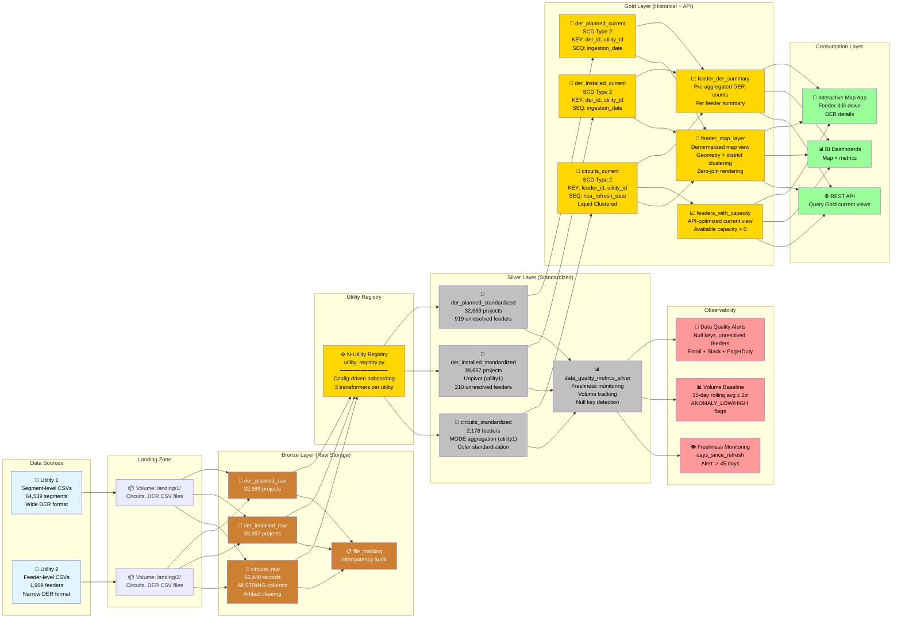
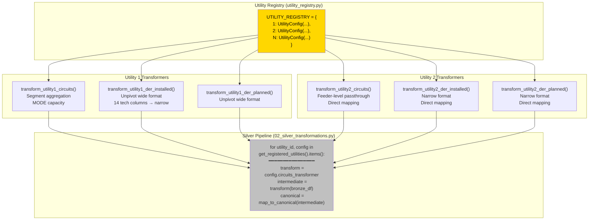
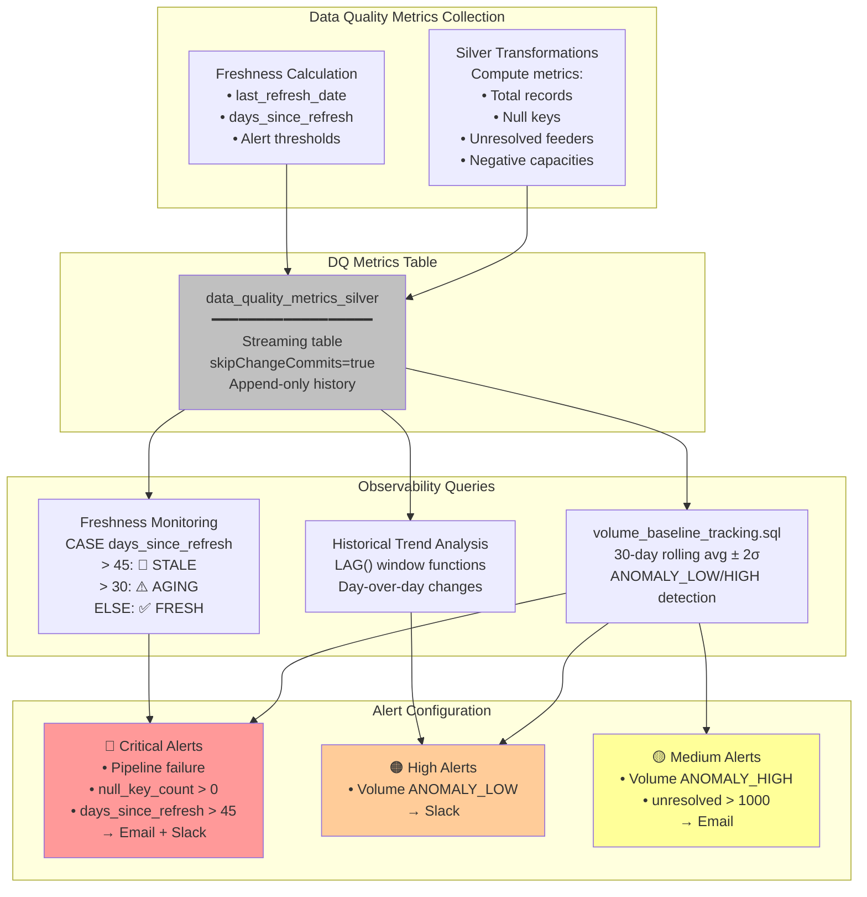
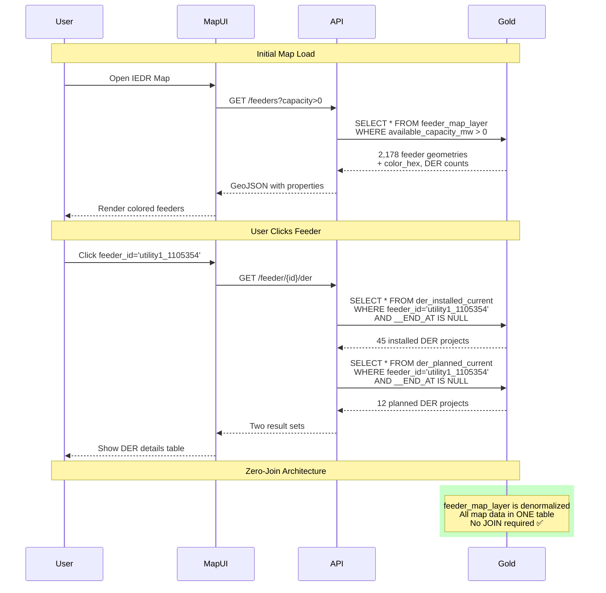
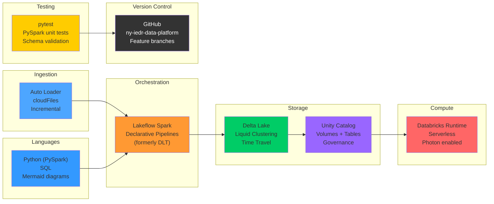

# NY IEDR Data Platform - Solution Architecture Diagram

## 📊 High-Level Architecture



---

## 🔄 Detailed Transformation Flow

```mermaid
flowchart LR
    subgraph "Bronze: Raw Ingestion"
        BR1["Auto Loader<br/>cloudFiles<br/>Schema evolution"]
        BR2["Artifact Clearing<br/>_c0, _file_path<br/>Case variant extraction"]
        BR3["File Tracking<br/>MD5 signature<br/>Idempotency"]
    end

    subgraph "Silver: Standardization"
        SR1["Registry Transformers<br/>Utility-specific logic<br/>Intermediate schema"]
        SR2["Canonical Mapping<br/>Type casting<br/>Date parsing<br/>Color standardization"]
        SR3["MODE Aggregation<br/>Segment → Feeder<br/>utility1 only"]
        SR4["DER Unpivot<br/>Wide → Narrow<br/>utility1 only"]
        SR5["Quality Checks<br/>@dlt.expect_or_drop<br/>Unresolved tracking"]
    end

    subgraph "Gold: History + API"
        GR1["Auto CDC<br/>SCD Type 2<br/>Track changes over time"]
        GR2["Liquid Clustering<br/>utility_id + feeder_id<br/>Query optimization"]
        GR3["Current Views<br/>__END_AT IS NULL<br/>API-optimized"]
        GR4["Map Layer<br/>Geometry + grid<br/>Denormalized"]
    end

    BR1 --> BR2
    BR2 --> BR3
    BR3 --> SR1
    SR1 --> SR2
    SR2 --> SR3
    SR3 --> SR4
    SR4 --> SR5
    SR5 --> GR1
    GR1 --> GR2
    GR2 --> GR3
    GR3 --> GR4

    style BR1 fill:#cd7f32,color:#fff
    style BR2 fill:#cd7f32,color:#fff
    style BR3 fill:#cd7f32,color:#fff
    style SR1 fill:#c0c0c0
    style SR2 fill:#c0c0c0
    style SR3 fill:#c0c0c0
    style SR4 fill:#c0c0c0
    style SR5 fill:#c0c0c0
    style GR1 fill:#ffd700
    style GR2 fill:#ffd700
    style GR3 fill:#ffd700
    style GR4 fill:#ffd700
```



---

## 🏗️ N-Utility Registry Pattern



**Onboarding Utility 3:**
1. Write 3 transformer functions
2. Add to `UTILITY_REGISTRY`
3. Upload CSVs to `/Volumes/.../landing/3/`
4. **Zero pipeline code changes** ✅

---

## 📊 Data Quality & Observability Flow



---

## 🗺️ Map Application Query Pattern



---

## 🔧 Technology Stack



---

## 📈 Current State (2026-07-08)

### ✅ **Production-Ready Status**

| Component | Status | Details |
|-----------|--------|----------|
| **Bronze Layer** | ✅ Complete | 66,448 circuits, 72,346 DER, artifact clearing |
| **Silver Layer** | ✅ Complete | MODE aggregation, unpivot, color standardization |
| **Gold Layer** | ✅ Complete | SCD Type 2, API views, map layer |
| **Observability** | ✅ Complete | Freshness monitoring, volume baseline, alerts |
| **Testing** | ✅ Validated | 2 successful runs (full refresh + incremental) |
| **Documentation** | ✅ Complete | ARCHITECTURE.md, JOB_ALERT_SETUP.md |
| **Code Quality** | ✅ Refactored | Silver: 450 → 306 lines (-144 lines) |

### 📊 **Data Volumes**
- **Circuits**: 2,178 feeders (269 utility1 + 1,909 utility2)
- **DER Installed**: 39,657 projects (14,120 utility1 + 25,537 utility2)
- **DER Planned**: 32,689 projects (1,733 utility1 + 30,956 utility2)
- **Total Tables**: 17 across 4 layers

### ⚠️ **Data Quality Findings**
- **Freshness**: Both utilities STALE (Oct 2022 data, 1,362-1,376 days old)
- **Unresolved Feeders**: 210 installed, 919 planned (need linkage improvement)
- **Null Keys**: 0 (all expectations passing) ✅

### 🚀 **Next Steps**
1. Deploy to `prod_iedr` catalog
2. Schedule pipeline (daily/weekly cadence)
3. Configure Databricks SQL Alerts
4. Set up monitoring dashboards
5. Production smoke tests

---

## 📚 File Locations

```
ny-iedr-data-platform/
├── pipelines/
│   ├── 01_bronze_ingestion.py          # Auto Loader, artifact clearing
│   ├── 02_silver_transformations.py    # MODE aggregation, registry loop
│   ├── 03_gold_scd2.py                 # SCD Type 2, API views
│   └── utils/
│       ├── helpers.py                  # Lineage, artifact helpers
│       ├── utility_registry.py         # N-utility config, transformers
│       └── schema_normalization.py     # Canonical mapping, colors
├── tests/
│   └── test_schema_normalization.py    # Unit tests (20+ cases)
├── docs/
│   ├── ARCHITECTURE.md                 # Detailed architecture
│   ├── SOLUTION_ARCHITECTURE_DIAGRAM.md # THIS FILE
│   ├── JOB_ALERT_SETUP.md             # Alert configuration guide
│   └── volume_baseline_tracking.sql    # Anomaly detection query
└── README.md                           # Project overview
```

---

**Legend:**
- 🥉 Bronze = Raw storage (STRING columns, no transformation)
- 🥈 Silver = Standardized (typed, aggregated, quality-checked)
- 🥇 Gold = Historical + API-ready (SCD2, liquid clustered)
- ⚙️ Registry = Configuration-driven utility onboarding
- 👁️ Observability = Monitoring, alerting, anomaly detection
- 🗺️ Map = Geospatial rendering layer
